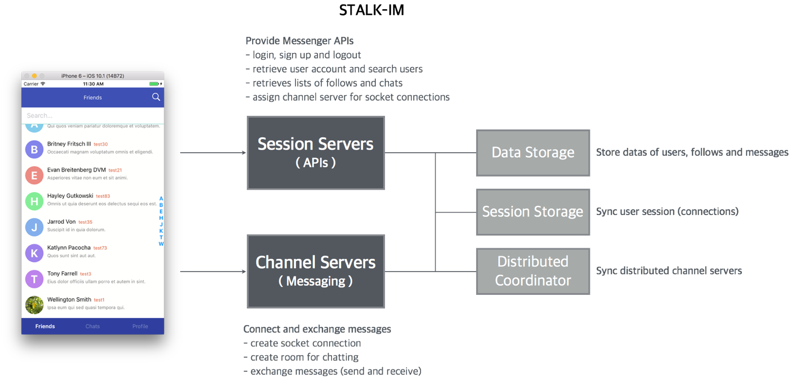

#chat-tutorial

이번 튜토리얼에서는 [ionic v2](http://ionicframework.com/docs/v2/)와 [STALK-IM](https://github.com/S5Platform/stalk-messenger-server)을 사용해서 간단한 채팅 서비스를 만들어보려고 합니다.

## Ionic Framework
-----------

[Ionic v2](http://ionicframework.com/docs/v2/)은 HTML, CSS, javascript 등의 WEB 기술을 이용하여 Native에 가까운 하이브리드앱을 만들 수 있도록 해주는 HTML5 SDK 입니다. AngularJS 기반으로 동작하며 다양한 형태의 Directive를 제공하기 때문에 빠른 시간에 Component 개발할 수 있으며 Cordova(PhoneGap) Plugin 을 지원해서 모바일앱에 필요한 다양한 기능을 구현할 수 있습니다.

Ionic 을 사용하여 하이브리드 앱을 개발할 경우 아래와 같은 장점이 존재합니다.

장점
- 웹표준을 이용하여 제작할 수 있기 때문에 기존 웹개발자들이 쉽게 앱을 개발할 수 있습니다.
- 각 플랫폼에서 맞는 스타일의 컴포넌트를 제공하기 때문에 쉽고 빠르게 UI를 개발할 수 있습니다.

Ionic을 활용하기 위해서는 디음과 같은 3가지 사전지식이 필요합니다.
- AngularJs2
- Node.js
- PhoneGap( Cordova )

이번 튜토리얼에서는 Ionic v2을 이용하여 채팅에 필요한 화면을 구현할 예정입니다.

## STALK-IM
-----------

[STALK-IM](https://github.com/S5Platform/stalk-messenger-server)은 [XPUSH](http://xpush.github.io/)을 활용한 오픈소스 메신져 플랫폼입니다. 유저 관리나 데이터 관리를 위해 `Parse 서버`를 활용하고 있고, 메시지 전송을 위해 `XPUSH`를 활용하고 있습니다. 클라우드 서비스를 활용하여 테스트가 가능하고, 직접 설치하여 사용할 수 있습니다. 

메신져 서비스를 만들기 위해 필요한 Backend의 기능들이 구현되어 있고, 주요 기능은 아래와 같습니다.

### 주요기능
 * 유저관리 : 회원가입, 로그인, 로그아웃, 프로필 관리
 * 친구관리 : 사용자조회, 친구추가, 친구삭제
 * 채널관리 : 채널조회, 채널삭제, 사용자초대
 * 메세지관리 : 메세지조회, 메시지 전송, 이미지 전송

이번 튜토리얼에서는 STALK-IM의 API와 Ioni v2를 활용하여 간단한 메신저를 구현해보겠습니다.