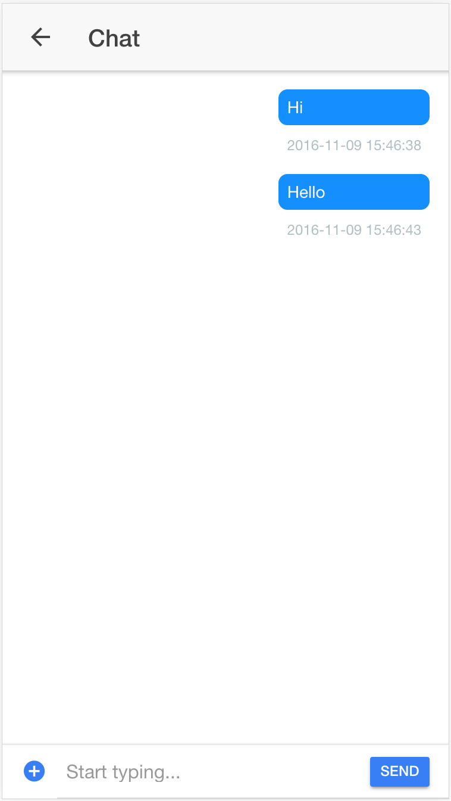

# 채팅 화면 만들기

이제 채팅 화면 만들어보겠습니다.

## 화면 구성하기
-----------

`pages/chat` 폴더 아래에 `chat.ts` 파일이 아래와 같이 생성되어 있습니다.

```javascript
import { Component, ElementRef, ViewChild, Renderer } from '@angular/core';

import { NavController, NavParams, Content } from 'ionic-angular';

import {SharedService} from '../../app/sharedService';

@Component({
  selector: 'page-chat',
  templateUrl: 'chat.html'
})

  inputMessage: any;
  messages:any[] = [];
  channel:any;

  @ViewChild(Content) content: Content;
  @ViewChild('fileInput') fileInput:ElementRef;

  constructor(private renderer: Renderer, public navCtrl: NavController, public ss: SharedService, private navParams: NavParams) {

    let users = navParams.get('users');
    let channelId = navParams.get('channelId');   
    var self = this;

    // Code here
    // STALK-IM을 이용하여 채팅 시작하기

    // Code here
    // 생성된 channel 객체를 이용해서, 메세지 목록 조회하기

    // Code here
    // 생성된 channel 객체에 onMessage 이벤트 등록하기
  }

  public send = () => {
    var msg = this.inputMessage;

    // Code here
    // stalk을 이용해서 text 메세지를 전송하기
    this.inputMessage = '';
  }
}
```

이에 대응하는 `chat.html` 파일이 아래와 같이 작성되어 있습니다.

```html
<ion-header>
  <ion-navbar>
    <ion-title>
      Chat
    </ion-title>
  </ion-navbar>
</ion-header>

<ion-content padding>
  <ol class="messages">
    <li *ngFor="let message of messages;" [ngClass]=" message.sent ? 'S':'R' ">
      
      <div *ngIf=" message.image ">
        <span>
          
        </span>
      </div>
      <div *ngIf=" message.text ">
        <span>{{message.text}}</span>
      </div>
      <span class="time">{{message.createdAt| date:"hh:mm:ss" }}</span>
    </li>
  </ol>
</ion-content>

<ion-footer class="bar-frosted" >
  <ion-item>
    <input type="file" #fileInput id="file" style="display:none" (change)="onFileChange($event, fileInput.value)" />
    <button ion-button icon-only item-left clear (click)="selectFile()">
      <ion-icon name="md-add-circle" ></ion-icon>
    </button>
    <ion-input [(ngModel)]="inputMessage" placeholder="Start typing..."></ion-input>
    <button ion-button item-right color="primary" style="min-width:50px;" (click)="send()" >Send</button>
  </ion-item>
</ion-footer> 
```

## STALK-IM으로 메시지 전송하기
-----------

이제 SharedService 로 등록된 `stalk` 객체를 이용하여 입력된 메세지를 실제로 전송해보겠습니다.

먼저 constructor 함수를 아래와 같이 수정하고, scrollToBottom 함수를 구현하겠습니다.

```javascript
  constructor(private renderer: Renderer, public navCtrl: NavController, public ss: SharedService, private navParams: NavParams) {

    let users = navParams.get('users');
    let channelId = navParams.get('channelId');

    var self = this;
    
    ss.stalk.openChannel( users, channelId, function( err, channel ){

      self.channel = channel;

      channel.loadMessages( function(err, messages ){
        self.messages = messages;
        self.scrollToBottom(messages.length * 20);
      });

      channel.onMessage( function(data){

        self.messages.push( data );
        self.scrollToBottom(100);
      });
    });
  }

  scrollToBottom(delay){
    var self = this;
    setTimeout(function(){
      try {
        self.content.scrollToBottom(delay);
      } catch ( err ){
      }
    }, delay);
  }
```

`openChannel` 함수의 인자로 users를, channelId와 넘기면, 채널에 연결할 수 있습니다. users는 채널에 포함된 사용자의 array이고 필수값입니다. `FollowsPage`에서 클릭시에 넘긴 channelId는 이미 알고 있는 channelId 정보가 있는 경우에 사용하며, optional 입니다. 향후 `ChatsPage`와 연계할 때 사용될 것읍니다. 채널 연결에 성공하면 callback으로 channel 객체를 받아오게 되고, 이를 사용해서 아래와 같은 기능을 사용할 수 있습니다.

- `loadMessages` : 현재 채널의 메세지를 조회
- `onMessage` : 현재 채널에서 메세지를 받았을 때의 이벤트 처리
- `sendText` : 텍스트 메시지 전송
- `sendImageFile` : 이미지 파일 전송

이제 send 함수를 아래와 같이 수정하겠습니다.

```javascript
  public send = () => {
    var msg = this.inputMessage;

    this.channel.sendText( msg );
    this.inputMessage = '';
  }
```

아래와 같은 화면이 완성되었습니다.



입력창에 메시지를 입력하고 Send 버튼을 누르면 메시지가 전송되는 것을 확인할 수 있습니다.

아래 코드를 추가하면 이미지 파일을 전송할 수 있습니다.

```javascript
  public selectFile = function () {
    var event = new MouseEvent('click', { bubbles: true });
    this.renderer.invokeElementMethod(this.fileInput.nativeElement, 'dispatchEvent', [event]);
  };

  public onFileChange = function ($event, fileValue) {
    var self = this;
    self.channel.sendImageFile(self.fileInput.nativeElement, function (error, result) {
      console.log( result );
    });
  };
```