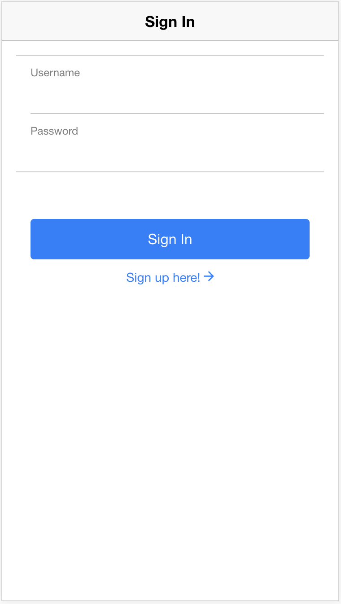

# 로그인화면 만들기

이제 로그인 화면 만들어보겠습니다.

## 화면 구성하기
-----------

`pages/account` 폴더 아래에 `signin.html` 파일이 아래와 같이 생성되어 있습니다.

```html
<ion-header>
  <ion-navbar>
    <ion-title>Sign In</ion-title>
  </ion-navbar>
</ion-header>

<ion-content padding>
  <div padding>
    <button ion-button color="primary" block (click)="signIn()">Sign In</button>
    <ion-col center text-center>
      <span color="primary" style="cursor:pointer;" [navPush]="pushPage">Sign up here!
        <ion-icon color="primary" name="md-arrow-forward"></ion-icon>
      </span>
    </ion-col>
  </div>
</ion-content>
``` 

`singin.html` 과 매핑되는 `signin.ts`이 아래와 같이 생성되어 있습니다.

```javascript
import { Component } from '@angular/core';

import { NavController, AlertController } from 'ionic-angular';
import { TabsPage } from '../tabs/tabs';
import { SignUpPage } from './signup';

import {SharedService} from '../../app/sharedService';

@Component({
  selector: 'page-signin',
  templateUrl: 'signin.html'
})
export class SignInPage {

  username: string;
  password: string;

  pushPage: any;

  constructor(public navCtrl: NavController, public ss: SharedService, public alertCtrl: AlertController) {
  }

  public signIn =()=> {
    var self = this;
  }
}
```

## 입력창과 버튼 생성하기

이제 signin.html 파일에 입력창과 로그인 버튼, 그리고 회원가입 페이지로의 링크를 추가하겠습니다.
  
```html
<ion-content padding>
  <ion-list>
    <ion-item>
      <ion-label stacked>Username</ion-label>
      <ion-input type="text" [(ngModel)]="username" value=""></ion-input>
    </ion-item>
    <ion-item>
      <ion-label stacked>Password</ion-label>
      <ion-input type="password" [(ngModel)]="password"  ></ion-input>
    </ion-item>
  </ion-list>
  <div padding>
    <button ion-button color="primary" block (click)="signIn()">Sign In</button>
    <ion-col center text-center>
      <span color="primary" style="cursor:pointer;" [navPush]="pushPage">Sign up here!
        <ion-icon color="primary" name="md-arrow-forward"></ion-icon>
      </span>
    </ion-col>
  </div>
</ion-content>
```

이곳에서는 회원가입 페이지로의 전환을 위해 [ionic의 navPush](http://ionicframework.com/docs/v2/api/components/nav/NavPush/)를 사용했습니다.

[navPush](http://ionicframework.com/docs/v2/api/components/nav/NavPush/) 프로퍼티를 `pushPage` 변수에 바인딩 하고,
`pushPage`에 이동할 페이지를 매핑하면 해당 화면으로 이동할 수 있습니다.

이제 아래와 같이 생성자를 수정한 후에 화면을 확인하면 **Sign up here!** 링크를 클릭하여 회원가입 페이지로 이동할 수 있습니다.

```javascript
constructor(public navCtrl: NavController, public ss: SharedService, public alertCtrl: AlertController) {
  this.pushPage = SignUpPage;
}
```

아래와 같은 화면이 생성되었습니다.



## STALK-IM에 로그인하기
-----------

이제 stalk 객체를 이용해서 signIn 함수를 아래와 같이 수정하겠습니다.

```javascript
  public signIn =()=> {
    var self = this;
    this.ss.stalk.logIn(this.username, this.password, function(err, user){
      if( err ){
        var message = err.message;
        let alert = self.alertCtrl.create({
          title: 'SignIn Failed',
          subTitle: message,
          buttons: ['OK']
        });
        alert.present();
        return;
      }

      // TabPage로 이동
      self.navCtrl.push(TabsPage, {});
    });
  }
```

입력창에 username 와 password를 입력하고 **Sign In** 버튼을 클릭하면, 정상적으로 Login이 되는 것을 확인하실 수 있습니다.
로그인이 성공되면, `TabPage`로 이동하도록 코드를 구현했습니다.