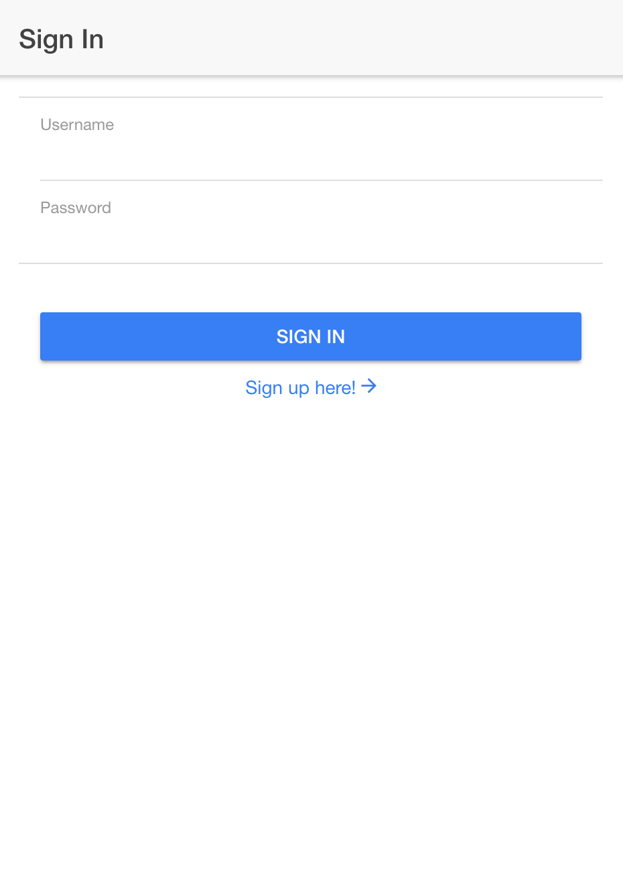

# 로그인 만들기

## 화면 구성하기
-----------

account 폴더 아래에 signin.html 파일을 생성하겠습니다.

이제 상단 헤더영역과 기본 화면을 생성하겠습니다.

```html
<ion-header>
  <ion-navbar>
    <ion-title>Sign In</ion-title>
  </ion-navbar>
  <ion-content padding>
  </ion-content padding>
</ion-header>
``` 

singin.html 과 매핑될 signin.ts을 생성하겠습니다.

```javascript
import { Component } from '@angular/core';
import { SignUpPage } from './signup';

@Component({
  selector: 'page-signin',
  templateUrl: 'signin.html'
})
export class SignInPage {
  constructor(public navCtrl: NavController, public ss: SharedService{
    this.pushPage = SignUpPage;
  }
}
```

## 입력창과 버튼 생성하기

singin.ts 파일에 username, password 를 입력받기 위한 변수와 로그인 버튼 이벤트를 위한 메소드를 생성하겠습니다.

```javascript
  username: string;
  password: string;

  private pushPage: any;

  public signIn(){
    var self = this;
    console.log( self.username );
    console.log( self.paassword );
  }
 ```

이제 signin.html 파일에 입력창과 로그인 버튼, 그리고 회원가입 페이지로의 링크를 추가하겠습니다.
  
```html
<ion-content padding>
  <ion-list>
    <ion-item>
      <ion-label stacked>Username</ion-label>
      <ion-input type="text" [(ngModel)]="username" value=""></ion-input>
    </ion-item>
    <ion-item>
      <ion-label stacked>Password</ion-label>
      <ion-input type="password" [(ngModel)]="password"  ></ion-input>
    </ion-item>
  </ion-list>
  <div padding>
    <button ion-button color="primary" block (click)="signIn()">Sign In</button>
    <ion-col center text-center>
      <span color="primary" style="cursor:pointer;" [navPush]="pushPage">Sign up here!
        <ion-icon color="primary" name="md-arrow-forward"></ion-icon>
      </span>
    </ion-col>
  </div>
</ion-content>
```

이곳에서는 페이지 전환을 위해 [ionic의 navPush](http://ionicframework.com/docs/v2/api/components/nav/NavPush/)를 사용했습니다.

이제 아래와 같은 화면이 생성되었습니다.


## S5Platform에 로그인하기
-----------

이제 stalk 객체를 이용해서 signIn 함수를 아래와 같이 수정하겠습니다.

```javascript
  public signIn(){
    var self = this;

    this.ss.stalk.logIn(this.username, this.password, function(err, user){
      console.log( user );
    });
  };
```

입력창에 username 와 password를 입력하고 `Sign In` 버튼을 클릭하면, 정상적으로 Login이 되는 것을 확인하실 수 있습니다.
로그인이 완료되면, 기존의 메인 Page 였던 TabPage로 이동하도록 signIn 함수를 수정하겠습니다.

```javascript
  self.navCtrl.push(TabsPage, {});
```

logIn 실패 시에 alert 창을 보여주기 위한 로직을 추가하여 아래와 같은 코드가 완성되었습니다.

#### `signin.ts`

```javascript
import { Component } from '@angular/core';

import { NavController, AlertController } from 'ionic-angular';
import { TabsPage } from '../tabs/tabs';
import { SignUpPage } from './signup';

import {SharedService} from '../../app/sharedService';

@Component({
  selector: 'page-signin',
  templateUrl: 'signin.html'
})
export class SignInPage {

  username: string;
  password: string;

  private pushPage: any;

  constructor(public navCtrl: NavController, public ss: SharedService, public alertCtrl: AlertController) {
    this.pushPage = SignUpPage;
  }

  public signIn(){
    var self = this;
    this.ss.stalk.logIn(this.username, this.password, function(err, user){
      if( err ){
        var message = err.message;
        let alert = self.alertCtrl.create({
          title: 'SignIn Failed',
          subTitle: message,
          buttons: ['OK']
        });
        alert.present();
        return;
      }
      self.navCtrl.push(TabsPage, {});
    });
  }
}
```

#### `signin.html`
```html
<ion-header>
  <ion-navbar>
    <ion-title>Sign In</ion-title>
  </ion-navbar>
</ion-header>

<ion-content padding>
  <ion-list>
    <ion-item>
      <ion-label stacked>Username</ion-label>
      <ion-input type="text" [(ngModel)]="username" value=""></ion-input>
    </ion-item>
    <ion-item>
      <ion-label stacked>Password</ion-label>
      <ion-input type="password" [(ngModel)]="password" ></ion-input>
    </ion-item>
  </ion-list>
  <div padding>
    <button ion-button color="primary" block (click)="signIn()">Sign In</button>
    <ion-col center text-center>
      <span color="primary" style="cursor:pointer;" [navPush]="pushPage">Sign up here!
        <ion-icon color="primary" name="md-arrow-forward"></ion-icon>
      </span> 
    </ion-col>
  </div>
</ion-content>
```