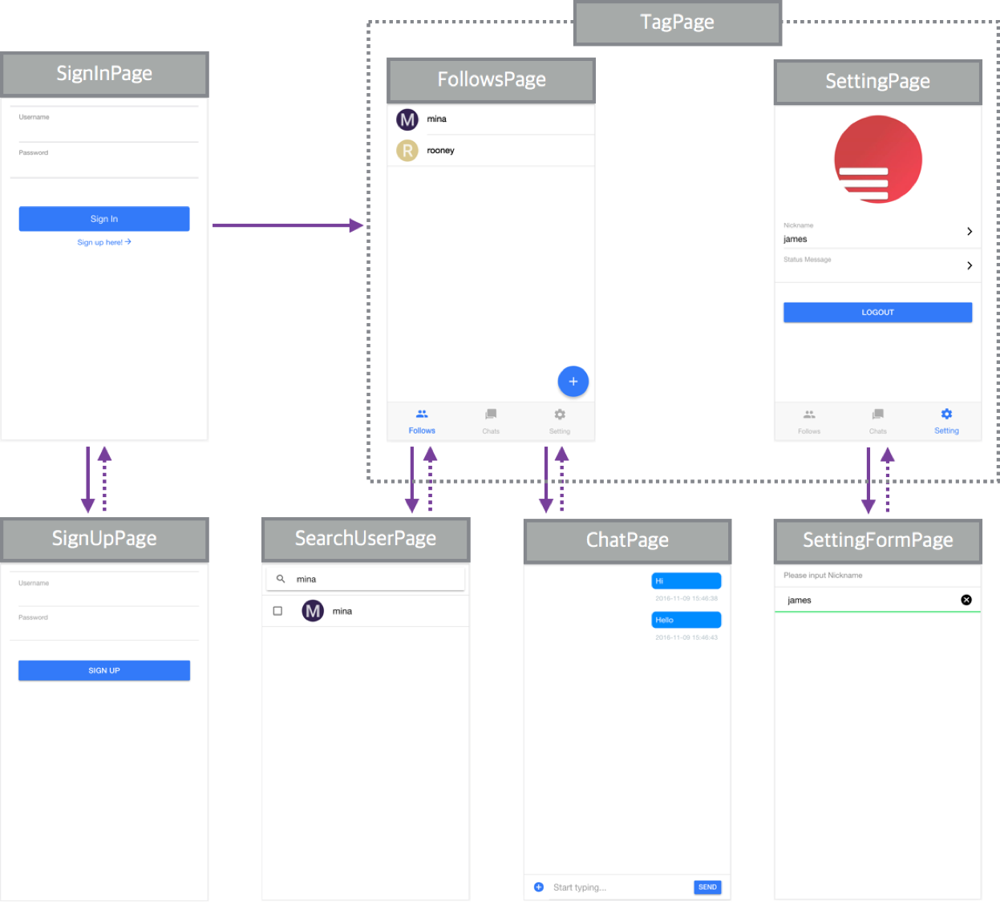

# 화면개발하기

## 화면리스트와 화면 흐름
-----------

## 주요모델
-----------
#### User
- `id` : 회원가입시 자동생성되는 Key
- `username` : 회원가입시 사용한 username
- `nickName` : 대화명
- `avatar` : 프로필 사진 URL
- `statusMessage` : 상태메세지

#### Channel
- `channelId` : channel 연결시 자동생성되는 id
- `users` : channel에 속해 있는 사용자 목록. *Array*
- `updatedAt` : channel이 변경된 시간 *Date*
- `updated` : channel이 변경된 시간 *String*
- `name` : channel의 이름
- `image` : channel의 이미지

#### Message
- `_id` : message 전송시 자동생성되는 id
- `text` : 텍스트 형태의 메시지 전송시
- `image` : 이미지 형태의 메시지 전송시
- `createdAt` : 메시지가 발송된 시간. *Date*
- `created` : 메시지가 발송된 시간. *String*
- `user` : 메세지를 전송한 user. *Object*
- `sent` : 메시지 발송했는지 여부 ( true of false ) 현재 사용자가 보낸 메세지일 경우, true

## TODO LIST
-----------
#### 기본 기능
- [ ] 회원 가입
- [ ] 로그인
- [ ] 회원 가입시 confirm password validation(Optional)

#### Follows Tab
- [ ] 친구 목록 조회
- [ ] 친구 추가
- [ ] 친구 삭제(Optional)
- [ ] 채팅화면 이동
- [ ] Notification 처리(Optional)

#### Channels Tab
- [ ] 채널 목록 조회(Optional)
- [X] 채팅화면 이동(Optional)

#### 채팅화면
- [ ] 메시지 목록 조회
- [ ] 텍스트 메시지 전송
- [ ] 이미지 전송
- [ ] 메세지 받은 후 스크롤 처리
- [ ] 메시지 받은 시간 표시
- [ ] 보낸 사람 Nickname, avatar 표시(Optional)

#### Settings Tab
- [ ] Profile 이미지 업로드 구현(Optional)
- [ ] Nickname 관리 기능 구현(Optional)
- [ ] Status Message 관리 기능 구현(Optional)
- [ ] 로그아웃(Optional)