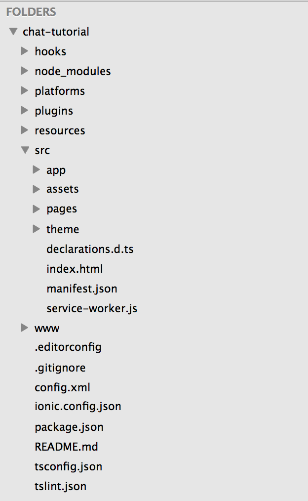

# 프로젝트 시작하기

[Prepare](prepare.md) 단계에서 설치한 ionic을 이용하여 [Tab Template](https://github.com/driftyco/ionic2-starter-tabs)을 활용한 프로젝트를 생성할 수 있습니다.

이번 튜토리얼 세션에서는 [ionic2의 Tab Template](https://github.com/driftyco/ionic2-starter-tabs)을 활용하여 미리 생성한 프로젝트를 이용하여 실습을 진행하겠습니다.


## 프로젝트 다운로드
-----------

```bash	
$ git clone https://github.com/0nlyoung7/chat-tutorial
```

생성된 chat-tutorial 프로젝트 폴더로 이동하여 `npm install` 명령어를 통해 모듈 설치를 진행하겠습니다.

```bash
$ cd chat-tutorial
$ npm install
```

## 프로젝트 구조
-----------

모듈 설치한 완료후 해당 프로젝트 폴더를 에디터를 이용하여 열어보면 다음과 같은 구조로 되어 있는 것을 확인 하실 수 있습니다.



### ./src/index.html

`src/index.html` 은 이 프로젝트의 시작 페이지입니다.
ionic을 사용하기 위한 angular, bootstrap 등의 javascript와 css 파일이 import 되어 있습니다.

```html
<link href="build/main.css" rel="stylesheet">

<ion-app></ion-app>
<script src="build/polyfills.js"></script>
<script src="build/main.js"></script>
```

아래와 같이 [S5Platform](https://github.com/S5Platform)을 활용하기 위한 Javascript SDK 또한 포함되어 있습니다.

```html
<script src="https://rawgit.com/S5Platform/Stalk-SDK-JS/master/dist/stalk-im.min.js"></script>
```
	
### ./src/

실제로 작업을 수행할 디렉토리입니다. 튜토리얼에서 사용될 주요 파일들에 대해 알아보겠습니다.

- `src/app/app.module.ts` : angular2 에서 사용하는 모듈 설정 파일입니다. ionic 에서 제공하는 module과 화면 요소들, plugin 대한 설정이 포함되어 있습니다.
- `src/app/sharedService.js` : `stalk-im`의 Javacript SDK 를 활용하기 위해 초기화 함수와 Object가 선언되어 있습니다.
- `src/app/pages` : 화면을 그리기 위해 사용될 TypeScript와 html, scss 파일들이 포함되어 있습니다. 

## 프로젝트 실행
-----------
이제 프로젝트를 실행해보겠습니다.
아래 명령어를 이용하여 프로젝트를 실행하면 브라우져를 통해 화면을 확인할 수 있습니다.

```bash
$ ionic serve
```

> default로 `http://ip:8100` 실행됩니다.

이제 화면개발을 위한 준비가 완료되었습니다.

먼저, 회원가입 화면을 개발하겠습니다.